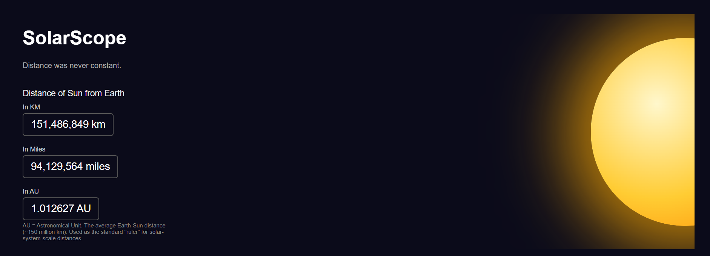
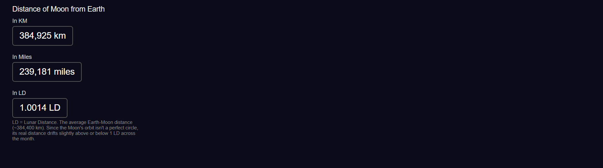

# SolarScope

**Distance was never constant.**

A real-time Solar System dashboard that computes the live Earth–Sun and Earth–Moon distances using actual ephemeris data, not static averages.



## What it does

Most "distance to the Sun/Moon" numbers you find online are fixed averages (1 AU, 384,400 km). But Earth's orbit is elliptical and the Moon's orbit isn't a perfect circle either, so the real distance drifts throughout the year (and month). SolarScope queries the actual current position of each body and computes the live distance on every request.

- **Sun distance** — shown in KM, Miles, and AU
- **Moon distance** — shown in KM, Miles, and LD (Lunar Distance)



## Tech stack

- **Backend:** Python, [FastAPI](https://fastapi.tiangolo.com/)
- **Astronomy engine:** [Astropy](https://www.astropy.org/) — `get_body_barycentric` for solar-system-scale positional data
- **Frontend:** Static HTML served directly by FastAPI

## How it works

1. `main.py` sets up the FastAPI app and exposes two endpoints:
   - `GET /api/sun` → returns live Earth–Sun distance in km, miles, and AU
   - `GET /api/moon` → returns live Earth–Moon distance in km, miles, and LD
2. Each endpoint gets the current barycentric position of Earth and the target body via Astropy, then computes the vector distance between them.
3. The `static/` folder is mounted as the frontend, so the dashboard is served directly from the same FastAPI app — no separate frontend server needed.

## Running it locally

```bash
pip install fastapi uvicorn astropy
uvicorn main:app --reload
```

Then open `http://127.0.0.1:8000` in your browser.

## Why AU / LD as units

- **AU (Astronomical Unit)** — the average Earth-Sun distance (~150 million km), used as the standard "ruler" for solar-system-scale distances.
- **LD (Lunar Distance)** — the average Earth-Moon distance (~384,400 km). Since the Moon's orbit isn't a perfect circle, its real distance drifts slightly above or below 1 LD across the month.

## Status

Actively maintained. Planned next: adding more solar system bodies (Mars, Venus) and a distance-over-time chart.
